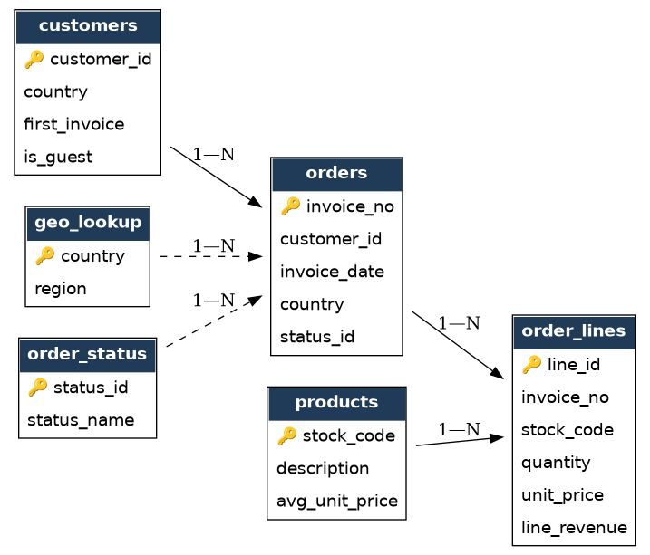
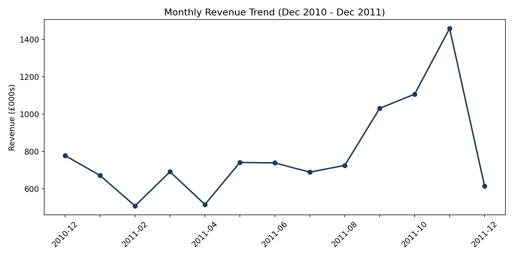
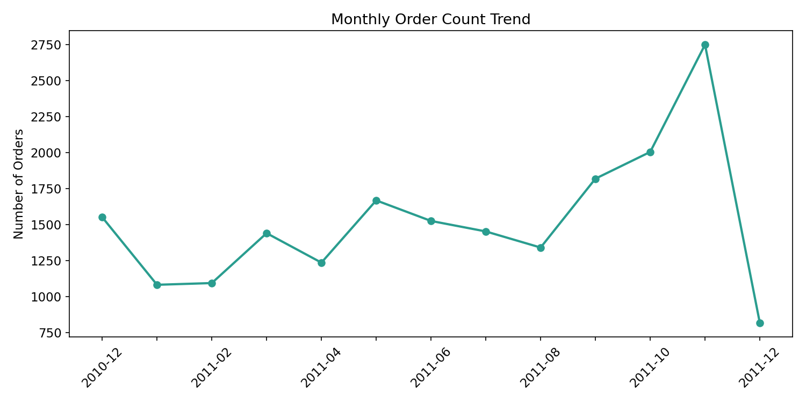
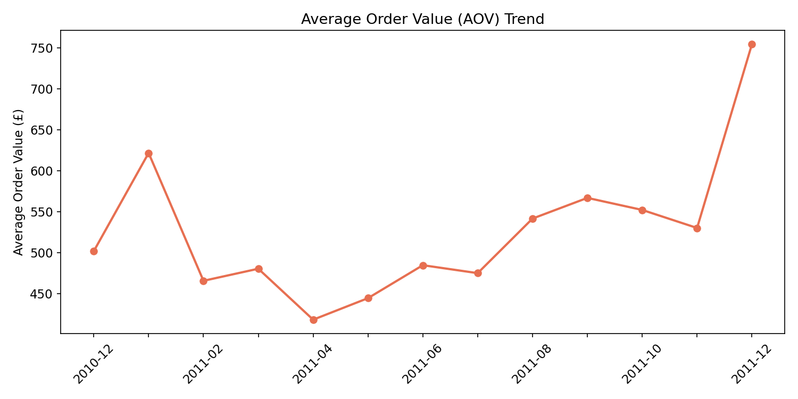
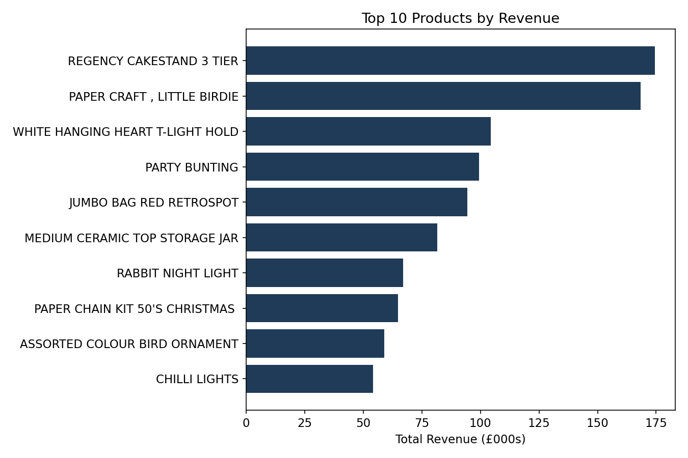
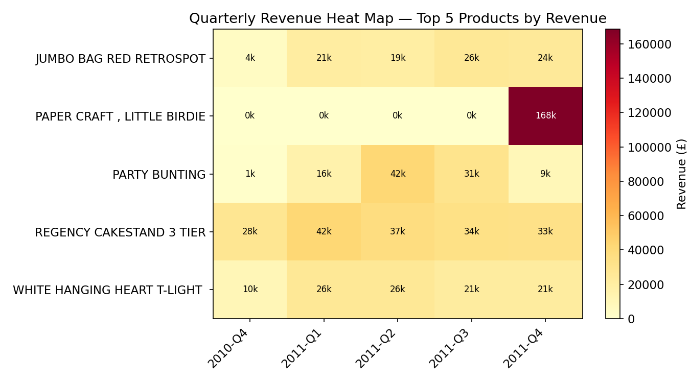
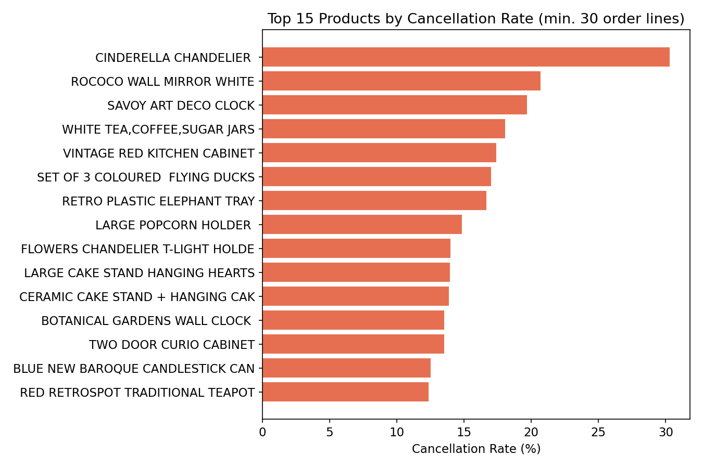
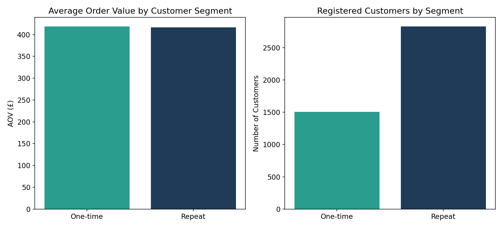
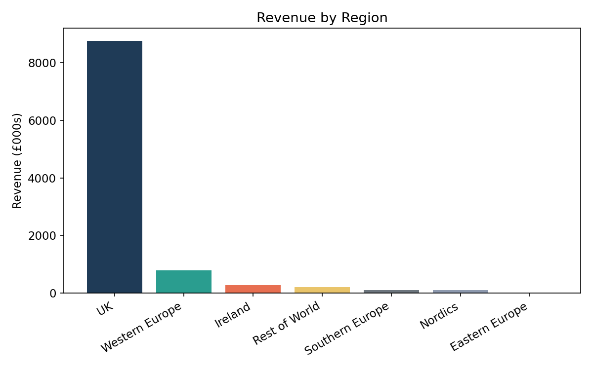
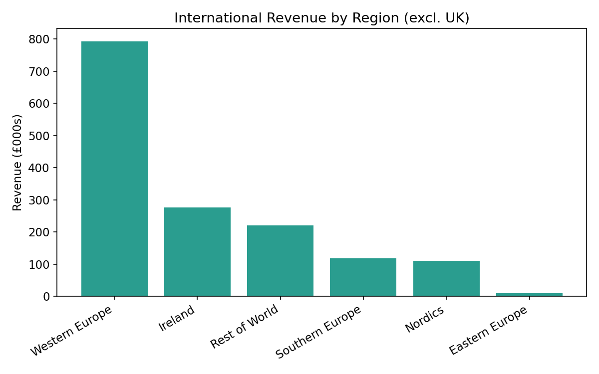

# UK Online Retail Performance Report

  

## Client Background

This analysis covers a **UK-based, non-store online retailer** that sells unique all-occasion gift and homeware items — think decorative lighting, storage tins, party supplies, and novelty homeware. A large share of the customer base are **wholesalers** buying in bulk rather than individual shoppers, which shapes several of the patterns below.

The dataset captures **541,909 raw transaction lines** across **25,897 invoices**, **4,372 registered customers**, and **38 countries**, spanning **01 December 2010 to 09 December 2011** (a single 13-month trading window — there is no prior year to compare against, so this report focuses on within-year seasonality rather than year-over-year growth).

Reporting to a Head of Operations, this review evaluates sales performance, product performance, customer purchasing behaviour, order cancellations, and regional demand, with the aim of surfacing insights that commercial and operations teams could act on.

**Source data:** [UCI Machine Learning Repository — Online Retail](https://archive.ics.uci.edu/dataset/352/online+retail) (Chen, D. 2015, CC BY 4.0). Original citation: Chen, Sain & Guo (2012), *Data mining for the online retail industry*, Journal of Database Marketing & Customer Strategy Management, Vol. 19, No. 3.

### Northstar Metrics
- **Sales trends** — revenue, order volume, and average order value (AOV) across the 13-month window.
- **Product performance** — best/worst sellers, and quarterly demand patterns for top products.
- **Cancellation rates** — which products get cancelled most often, and what that implies for quality or fit.
- **Customer behaviour** — how repeat customers compare to one-time buyers, and guest checkouts vs. registered accounts.
- **Regional results** — where revenue concentrates, and where there's room to grow.

---

## Executive Summary

| **Revenue & Volume**<br>£10.28M in completed revenue across 19,776 completed orders (25,897 total invoices, 14.8% cancelled).<br>Clear seasonal ramp toward Q4: revenue grew from £1.87M (Q1 2011) to £3.18M (Q4 2011, partial month included), consistent with holiday gift-buying.<br>November 2011 was the single strongest month (£1.46M) before the dataset cuts off on 9 December. | **Customers & Channels**<br>4,372 registered customers, plus a guest-checkout segment.<br>Guest orders are fewer (1,371) but carry a **much higher AOV (£1,102)** than registered-account orders (18,405 orders, AOV £476) — consistent with wholesale buyers checking out without registering.<br>Among registered customers, 65% are repeat buyers, and they generate 93% of registered-customer revenue. |
|---|---|
| **Products**<br>The Regency Cakestand 3 Tier is the top revenue product (£174K), followed closely by a single anomalous bulk order (see Data Quality Note below) and the White Hanging Heart T-Light Holder (£105K), the retailer's most recognisable item.<br>Decorative "statement" pieces (chandeliers, mirrors, ornate clocks) have the highest cancellation rates — over 3x the platform average. | **Regions**<br>The UK drives 85.1% of revenue (£8.75M). Western Europe is the largest secondary market (7.7%, £793K), followed by Ireland (2.7%) and the Rest of World bucket (2.2%).<br>Eastern Europe is the smallest contributor at 0.1% of revenue — a candidate for either investment or deprioritisation depending on strategic goals. |

---

## Dataset Structure and ERD

The raw file is a single flat transaction log (`InvoiceNo, StockCode, Description, Quantity, InvoiceDate, UnitPrice, CustomerID, Country`). For this project I rebuilt it into a **normalized relational schema** in SQLite — six tables, cleaned and joined through SQL — so the analysis reflects how this data would actually live in a production retail database.



- **`customers`** — one row per customer (registered or guest, where `customer_id = 0` groups all guest checkouts)
- **`orders`** — one row per invoice, with a status flag for completed vs. cancelled
- **`order_lines`** — one row per product line within an invoice
- **`products`** — one row per stock code, with the most common description and average unit price
- **`geo_lookup`** — maps each of the 38 countries to a region for roll-up reporting
- **`order_status`** — lookup table for completed (1) vs. cancelled (2)

**Cleaning steps** (see [`sql/02_cleaning.sql`](sql/02_cleaning.sql)):
- Removed 3 "bad debt adjustment" invoices (InvoiceNo prefixed `A`) — these are accounting entries, not sales.
- Separated 9,288 cancelled-order lines (InvoiceNo prefixed `C`) into their own status rather than dropping them, so cancellation analysis is possible.
- Excluded non-merchandise stock codes (`POST`, `DOT`, `M`, `D`, `S`, `AMAZONFEE`, `CRUK`, `PADS`, `B`, `BANK CHARGES`) — postage, manual fees, discounts, and samples — from product-level analysis, but kept them in an `excluded_lines` audit table rather than silently deleting them.
- Dropped lines with zero/negative unit price or zero quantity (data entry errors).
- Result: **536,636 clean order lines** feeding the analysis, down from 541,909 raw rows.

### ⚠️ Data Quality Note
One line item — *"PAPER CRAFT, LITTLE BIRDIE"* (stock code 23843) — shows an 80,995-unit order worth £168,470 placed on a single invoice (581483) on 9 December 2011, which was **fully cancelled the same day** under a separate invoice (C581484). Because cancellations are tracked as a separate invoice number rather than a status update on the original, this order still counts as "completed" revenue under the original invoice, inflating that product's ranking. I've kept it in the results (rather than silently removing it) and flagged it here — in a live production report, this is exactly the kind of anomaly you'd raise with the data engineering team rather than quietly patch around.

---

# Insights Deep-Dive

## Sales Trend





**Revenue Growth Toward Q4**
- Revenue climbed each quarter across the year: £1.87M (Q1) → £2.00M (Q2) → £2.45M (Q3) → £3.18M (Q4, through 9 Dec only).
- November 2011 was the strongest full month on record (£1.46M revenue, 2,751 orders) — consistent with pre-Christmas gift buying.
- February and April 2011 were the softest months (£509K and £517K), a post-January and post-Easter lull.

**Order Volume Tracks Revenue Closely**
- Order counts follow the same shape as revenue — growth is being driven by more orders being placed, not by customers spending dramatically more per order.
- Order count nearly doubled from February (1,093 orders) to November (2,751 orders).

**AOV Is Relatively Stable, With One Notable Spike**
- AOV sits mostly in the £420–£570 range through most of the year.
- December 2011's AOV (£754) is the highest in the dataset, but the month is a partial 9-day window and likely skewed by a small number of large wholesale orders rather than a genuine trend.
- January 2011's AOV (£622) is also elevated relative to neighbouring months, worth a closer look at whether early-year restocking orders from wholesale customers are driving it.

**Caveat:** with only 13 months of data, this report can describe *within-year* seasonality (the Q4 ramp-up) but cannot confirm whether that pattern repeats year over year — a limitation worth stating upfront rather than implying more than the data supports.

---

## Product Performance




**Top Sellers**

| Rank | Product | Revenue | Units Sold |
|---|---|---|---|
| 1 | Regency Cakestand 3 Tier | £174,485 | 13,879 |
| 2 | Paper Craft, Little Birdie* | £168,470 | 80,995 |
| 3 | White Hanging Heart T-Light Holder | £104,519 | 37,660 |
| 4 | Party Bunting | £99,504 | 18,295 |
| 5 | Jumbo Bag Red Retrospot | £94,340 | 48,474 |
| 6 | Medium Ceramic Top Storage Jar | £81,701 | 78,033 |
| 7 | Rabbit Night Light | £66,965 | 30,788 |
| 8 | Paper Chain Kit 50's Christmas | £64,952 | 19,355 |
| 9 | Assorted Colour Bird Ornament | £59,095 | 36,461 |
| 10 | Chilli Lights | £54,118 | 10,306 |

*\*See Data Quality Note — this is a single cancelled bulk order, not a sustained seller.*

**Reading the Quarterly Heat Map**
- The Regency Cakestand is the only top-5 product with genuinely consistent quarter-over-quarter demand (£27K–£42K every quarter) — it's a dependable core product, not a seasonal one.
- Party Bunting spikes hard in Q2/Q3 2011 (spring/summer parties and events) and fades by Q4 — a candidate for seasonal inventory planning rather than year-round stocking.
- The White Hanging Heart T-Light Holder and Jumbo Bag Red Retrospot both show steady, moderate demand with a slight Q1 dip — likely a post-Christmas lull.

---

## Cancellation Rates



- **14.8% of all invoices** (3,836 of 25,897) were cancelled — a meaningful share of transaction volume worth investigating operationally.
- Cancellations concentrate heavily in **decorative "statement" items**: the Cinderella Chandelier (30.3% cancellation rate), Rococo Wall Mirror White (20.7%), and Savoy Art Deco Clock (19.7%) top the list — all 2–3x the typical rate for high-volume products.
- The pattern suggests these are either higher-consideration purchases (more likely to be reconsidered or duplicated-then-cancelled by wholesale buyers), or items where damage/breakage in transit drives higher return-and-cancel behaviour. The dataset doesn't record cancellation *reasons*, so this is a hypothesis to validate with the fulfilment team, not a conclusion.

---

## Customer Behaviour



**Guest vs. Registered Checkout**
- Guest checkouts are far less frequent (1,371 orders) but carry a **£1,102 average order value** — more than double the £476 AOV for registered-customer orders.
- This strongly suggests guest checkout is being used by wholesale/one-off bulk buyers rather than casual shoppers, who are more likely to register.

**One-Time vs. Repeat Customers** *(among the 4,334 registered, non-guest customers)*
- 2,829 customers (65%) placed more than one order; 1,505 (35%) ordered exactly once.
- Repeat customers generate **£2,877 in lifetime revenue on average**, versus £418 for one-time customers — a ~6.9x difference.
- Interestingly, the *per-order* value is almost identical between the two groups (£417 repeat vs. £418 one-time) — the entire lifetime-value gap comes from **purchase frequency**, not order size. This points toward retention and repeat-purchase campaigns as the higher-leverage lever, rather than trying to upsell bigger baskets.

*(Note: the source data has no loyalty-programme flag, unlike some retail datasets — this repeat-purchase segmentation is a reasonable substitute built directly from order history, and is flagged here as a modelling choice rather than a field in the raw data.)*

---

## Regional Results




| Region | Revenue | % of Total |
|---|---|---|
| UK | £8,749,722 | 85.1% |
| Western Europe | £793,143 | 7.7% |
| Ireland | £276,404 | 2.7% |
| Rest of World | £220,847 | 2.2% |
| Southern Europe | £118,311 | 1.2% |
| Nordics | £110,160 | 1.1% |
| Eastern Europe | £10,582 | 0.1% |

- The business is overwhelmingly UK-concentrated — expected for a "UK-based, non-store" retailer, but a concentration risk worth naming explicitly.
- Western Europe is a distant but clear second market; Germany, France, and the Netherlands are the largest contributors within it.
- Eastern Europe and the Nordics remain marginal — either an unexploited growth opportunity or evidence that international demand for this specific product range is genuinely UK/Western-Europe-centric.

---

## Recommendations

**Sales**
- Build Q4 promotional and inventory plans around the confirmed ramp-up pattern (Q1 £1.87M → Q4 £3.18M), and treat Feb/Apr as targeted low-season marketing windows.
- Validate whether the December AOV spike (£754) is a genuine wholesale pattern worth targeting with a B2B offer, or an artefact of the partial month.

**Products**
- Continue prioritising the Regency Cakestand and White Hanging Heart T-Light Holder — both show durable, non-seasonal demand.
- Plan Party Bunting inventory seasonally (build for Q2/Q3, don't over-stock for Q4).
- Flag the Paper Craft, Little Birdie anomaly to data/finance — it materially distorts the "top products" ranking and should be excluded from any downstream reporting that isn't explicitly auditing edge cases.

**Cancellations**
- Investigate fulfilment quality (packaging, breakage in transit) for the Cinderella Chandelier, Rococo Wall Mirror, and Savoy Art Deco Clock specifically — their cancellation rates are 2–3x the norm and they're all fragile, higher-value decorative pieces.
- A 14.8% overall cancellation rate is high enough to warrant a root-cause review even outside the top offenders.

**Customers**
- Since lifetime value is driven by purchase frequency rather than basket size, prioritise repeat-purchase campaigns (email re-engagement, replenishment reminders) over basket-size upsells.
- Investigate whether high-AOV guest checkouts represent an underserved wholesale segment that would benefit from a dedicated B2B account flow.

**Regions**
- Given 85% UK concentration, evaluate whether Western Europe (the clear #2 market) merits a dedicated growth push — localised marketing, EU-specific shipping options — before spreading effort thinner across smaller Southern Europe/Nordics markets.

---

## Repository Structure

```
├── README.md
├── data/
│   ├── Online_Retail_Raw.csv        # As downloaded, 541,909 rows
│   └── Online_Retail_Cleaned.csv    # Post-cleaning, analysis-ready, 536,636 rows
├── sql/
│   ├── 01_schema.sql                # Normalized table definitions
│   ├── 02_cleaning.sql              # Raw -> clean transformation logic
│   └── 03_analysis.sql              # All analytical queries behind this report
├── notebooks/
│   └── analysis.ipynb               # Python/matplotlib chart generation
├── visuals/                         # All chart PNGs used in this README
├── exports/                         # CSV exports of each analysis query, + cleaned .xlsx
├── requirements.txt
├── .gitignore                       # Excludes large data files/db from git — see note below
└── online_retail.db                 # SQLite database (schema + cleaned data)
```

## Tech Stack

- **SQL (SQLite)** — schema design, data cleaning, and all analytical aggregation (monthly trends, product rankings, cancellation rates, regional roll-ups, customer segmentation)
- **Python (pandas, matplotlib)** — chart generation from SQL query outputs
- **Graphviz** — ERD generation

## Reproducing This Analysis

```bash
pip install pandas openpyxl matplotlib graphviz

python3 -c "
import sqlite3, pandas as pd
conn = sqlite3.connect('online_retail.db')
df = pd.read_csv('data/Online_Retail_Raw.csv')
df.to_sql('raw_transactions', conn, if_exists='replace', index=False)
conn.executescript(open('sql/01_schema.sql').read())
conn.executescript(open('sql/02_cleaning.sql').read())
conn.commit()
"
```

Then run the queries in `sql/03_analysis.sql` directly, or open `notebooks/analysis.ipynb` to regenerate every chart in this README.

**Note on repo size:** the raw and cleaned CSVs are ~50MB each. If pushing this to GitHub, consider `.gitignore`-ing the CSVs and `online_retail.db` (keeping only the SQL scripts and a data-source link), or using Git LFS — GitHub will warn/reject pushes over 100MB.

## Source & License

Dataset: Chen, D. (2015). *Online Retail* [Dataset]. UCI Machine Learning Repository. https://doi.org/10.24432/C5BW33. Licensed CC BY 4.0.
